<h1 align="center">Casino Tracker</h1>

<p align="center">
  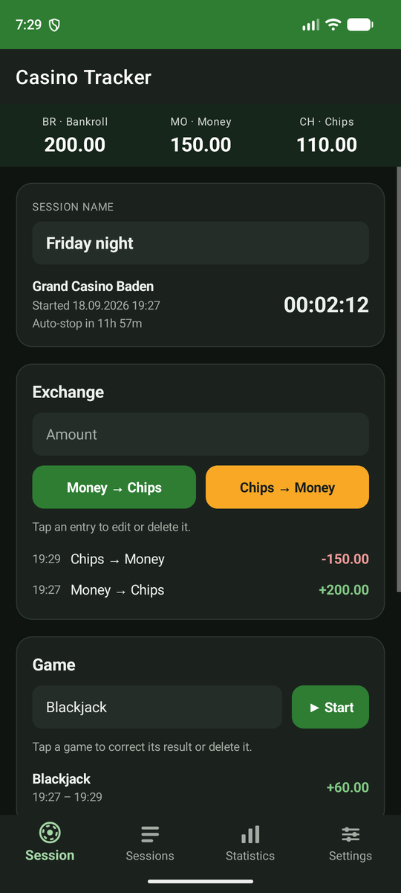
  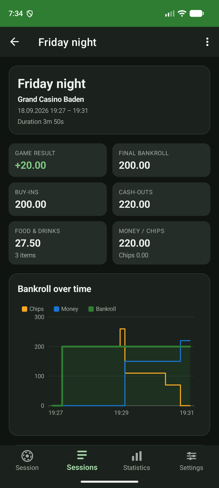
  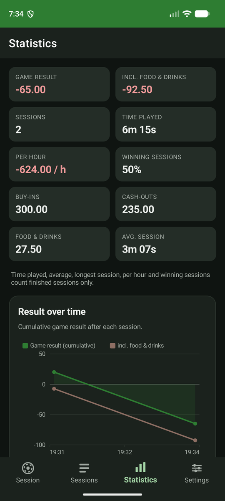
  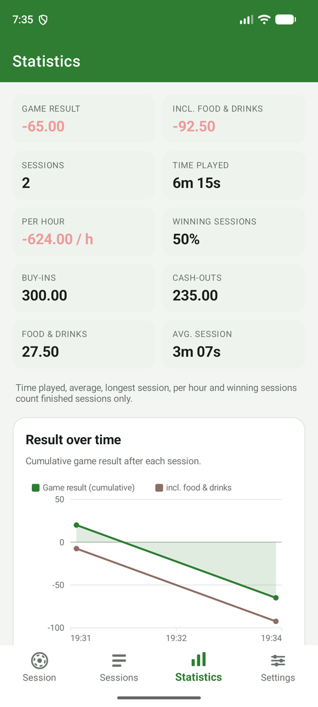
</p>

<p align="center">
  
  
  
  
</p>

A .NET MAUI (Android) app to track casino sessions: buy-ins and cash-outs, games played
and their results, food & drinks consumed, plus statistics across all sessions.

## Screenshots

All images were taken on the Android 14 emulator (Pixel 6 profile) with the Release build. Dark mode is the
default; the last row shows the light theme.

### Session

| Start a session | Running session | Games & food | Entering a game result |
| :---: | :---: | :---: | :---: |
| 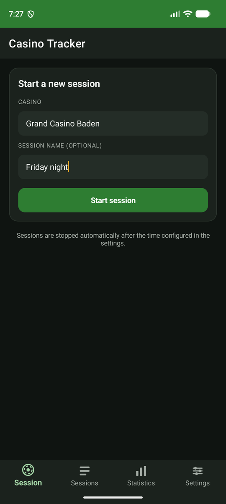 |  | 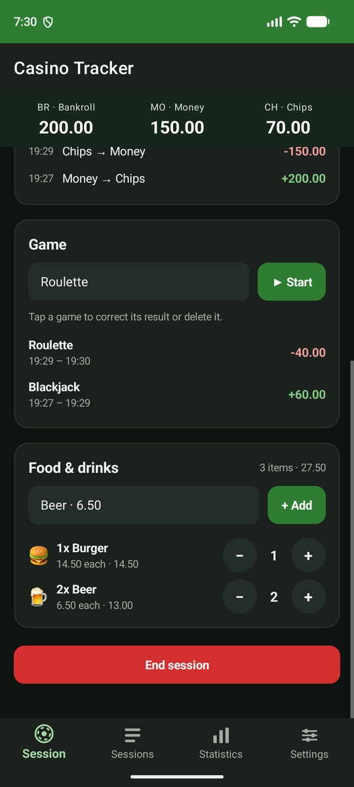 | 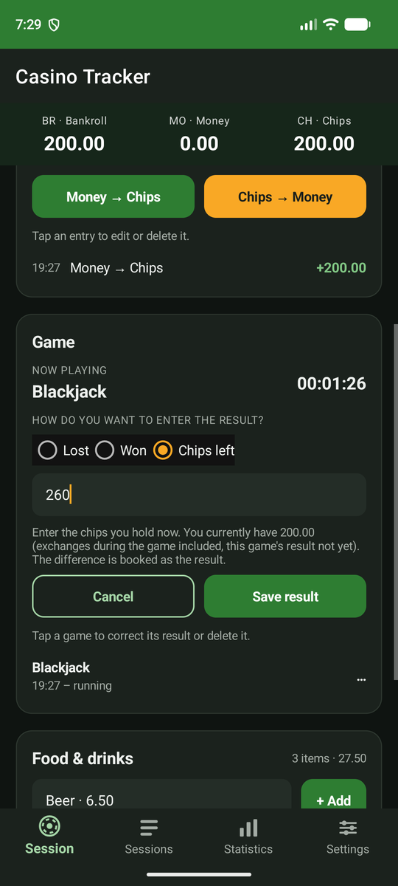 |

The header always shows **BR · Bankroll**, **MO · Money** and **CH · Chips**. Every exchange, game result
and consumed item can be tapped to correct or delete it. Ending a session asks for confirmation and shows the
final numbers:

| End session | Sessions list | Session detail | Exchanges & consumption |
| :---: | :---: | :---: | :---: |
| 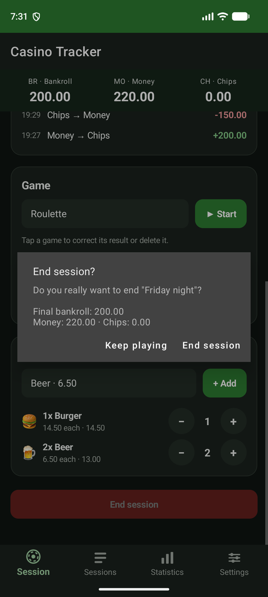 | 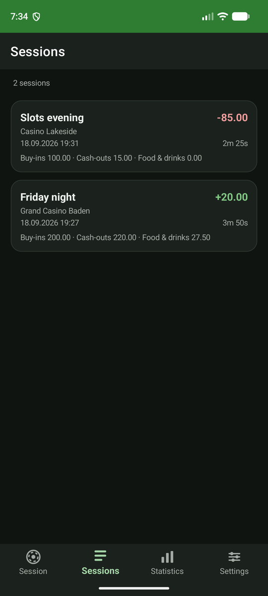 |  | 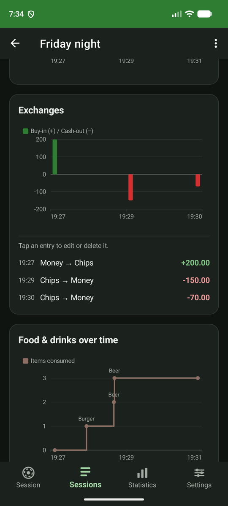 |

### Statistics

| Totals & result over time | Per month & per casino | Casino spending | Per game & consumption | Highlights |
| :---: | :---: | :---: | :---: | :---: |
|  | 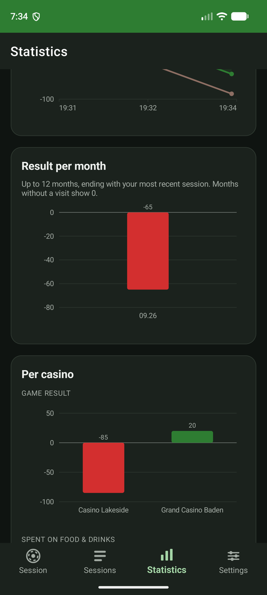 | 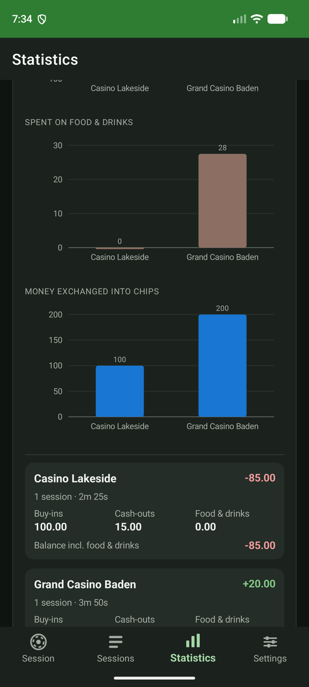 | 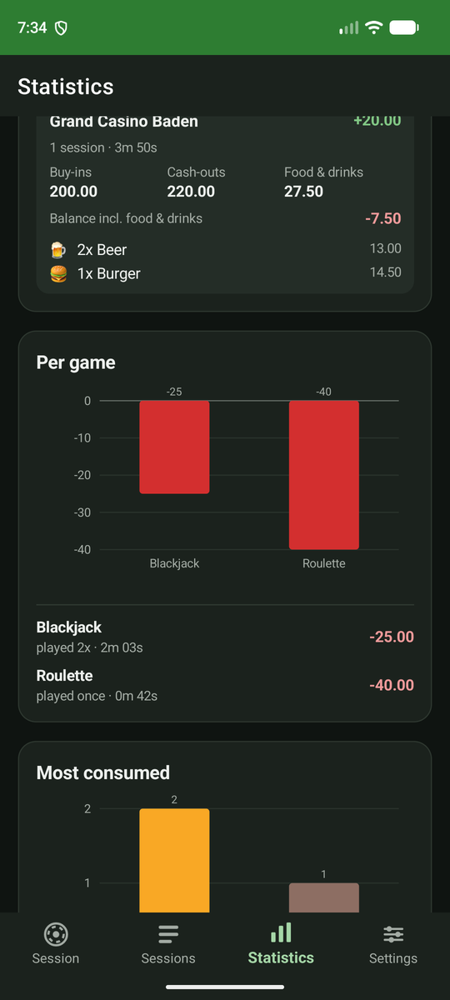 | 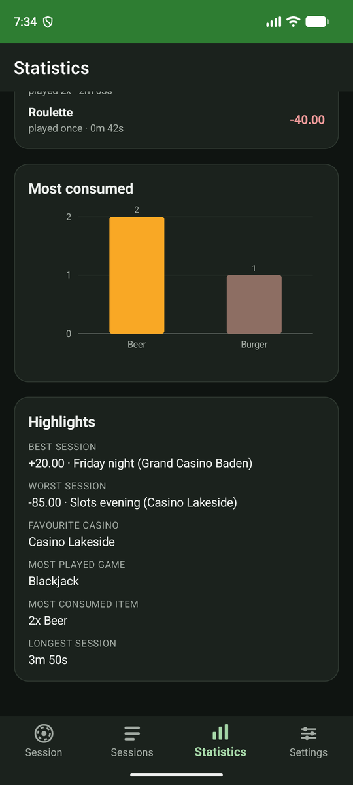 |

### Settings & catalog

| Settings | Casinos, menu items, games | Edit casino | New menu item |
| :---: | :---: | :---: | :---: |
| 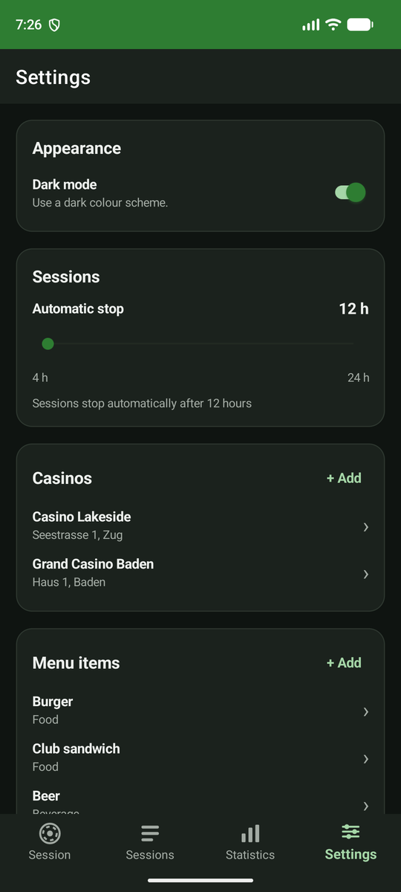 | 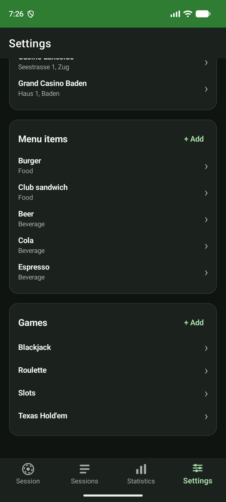 | 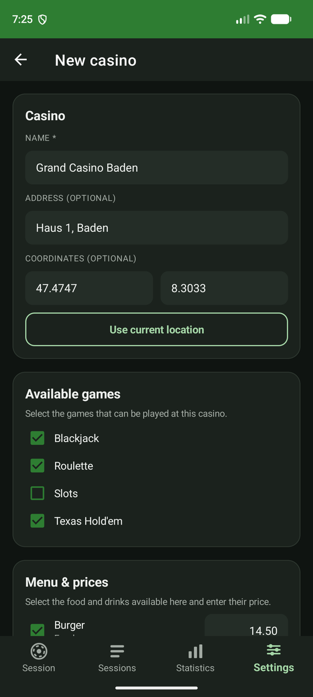 | 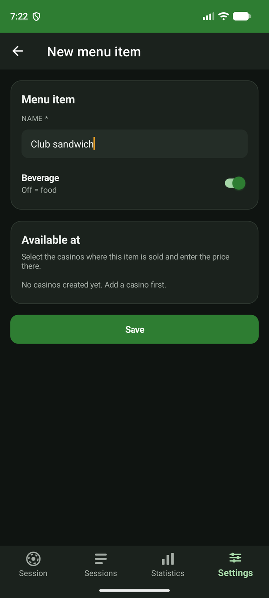 |

### Light theme

| Settings | Sessions | Session detail | Statistics |
| :---: | :---: | :---: | :---: |
| 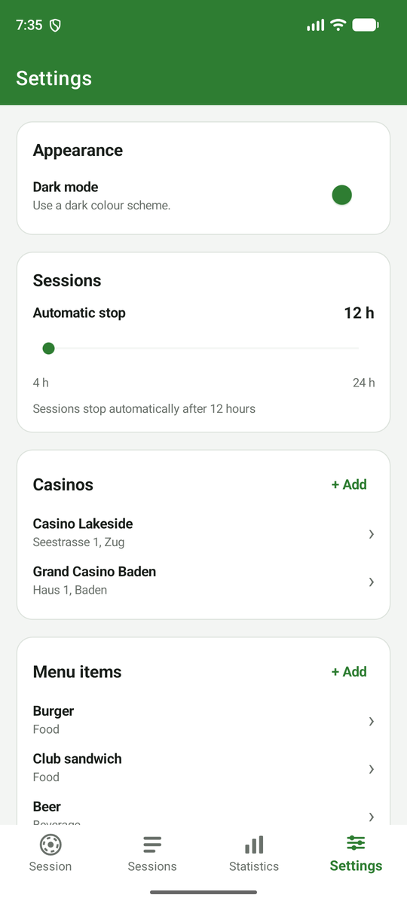 | 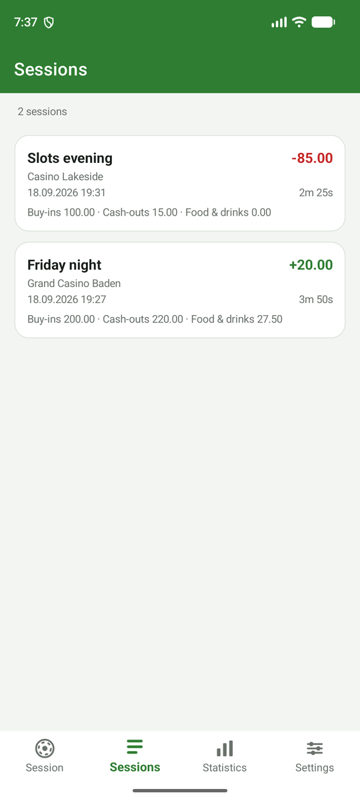 | 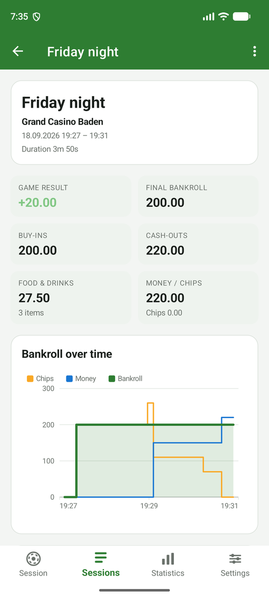 |  |

## Tech stack

| Area | Choice |
| --- | --- |
| Framework | .NET 10 / .NET MAUI (Android target) |
| Architecture | MVVM with `CommunityToolkit.Mvvm` (source generated `ObservableProperty` / `RelayCommand`) |
| Persistence | SQLite via `sqlite-net-pcl` (`SQLiteAsyncConnection`) |
| DI | `MauiApp.CreateBuilder().Services` – services, view models and pages are injected |
| Navigation | Shell (tab bar + registered routes, parameters via `IQueryAttributable`) |
| Charts | Own dependency-free `ChartView` based on `GraphicsView` |
| Settings | `IPreferences` (dark mode, auto-stop hours) |

## Project layout

```
CasinoTracker/
├── Models/            SQLite entities (Casino, Menuitem, Game, CasinoMenuitem, CasinoGame,
│                      Session, Exchange, ConsumedMenuitem, PlayedGame) + read models
├── Services/          IDatabaseService, ICasinoService, IMenuitemService, IGameService,
│                      ISessionService, IStatisticsService, ISettingsService,
│                      IDialogService, INavigationService (+ implementations)
├── Helpers/           BankrollCalculator (BR / MO / CH rules), MoneyHelper, TimeHelper
├── ViewModels/        One view model per page + Items/ (row models)
├── Views/             XAML pages (compiled bindings with x:DataType)
├── Controls/          ChartView + ChartDrawable (line / step / bar / scatter)
├── Converters/        Value converters used in XAML
├── Resources/Styles/  Colors.xaml, Styles.xaml (light + dark theme via AppThemeBinding)
└── Platforms/Android/ Manifest, MainActivity, MainApplication
```

## Database schema

All tables use an auto-increment integer primary key `Id`. Timestamps are Unix seconds.

| Table | Columns |
| --- | --- |
| `Casinos` | Id, Name, Address?, Latitude?, Longitude? |
| `Menuitems` | Id, Name, Beverage (bool; false = food) |
| `Games` | Id, Name |
| `CasinoMenuitems` | Id, CasinoId, MenuitemId, Price |
| `CasinoGame` | Id, CasinoId, GameId |
| `Session` | Id, Name, Starttime, Endtime?, CasinoId |
| `Exchanges` | Id, Amount (+ money→chips, − chips→money), SessionId, Timestamp |
| `ConsumedMenuitems` | Id, SessionId, MenuitemId, Timestamp |
| `PlayedGames` | Id, SessionId, GameId, Amount (won/lost delta), Starttime, Endtime? |

Deviations from the requested schema (all additive):

* `Session.Name` was added so a running session can be renamed.
* The optional `Coordinates` column is stored as two nullable doubles (`Latitude`, `Longitude`).
* `ConsumedMenuitems.Price` stores the menu price at the time of consumption, so later price changes or
  menu edits do not rewrite the history of past sessions. Rows without a snapshot fall back to the current price.

Foreign keys are enforced in the services (link rows are deleted with their parent; casinos,
menu items and games that are referenced by sessions cannot be deleted).

## Bankroll rules (`Helpers/BankrollCalculator.cs`)

* **CH (chips)** = Σ exchange amounts + Σ game results.
* **MO (money)** = everything cashed out. A later buy-in is subtracted from MO first; if the buy-in
  is larger than MO, MO becomes 0 and CH still increases by the full amount.
* **BR (bankroll)** = everything that came out of the wallet, i.e. the part of each buy-in that MO could
  not cover. Cash-outs and game results never change BR, so `MO + CH − BR` is the session result.

## Features

* **Session tab** – start a session for a casino, rename it inline, buy chips / cash out, start and
  stop a game (enter amount lost, amount won or chips left – the delta is calculated), add food & drinks
  (grouped as 1x / 2x / 3x with +/− buttons), and end the session after a confirmation. Tapping an
  exchange or a played game lets you correct the amount or delete the entry.
  Sessions are stopped automatically after the configured number of hours (checked on a timer while the
  page is visible, on app resume and whenever the page appears).
* **Sessions tab** – all sessions with result, duration and swipe-to-delete. Tapping opens the detail
  page with bankroll / chips / money over time, exchanges (chart + list), consumption over time
  (chart + list) and played games; entries can be corrected or removed there as well.
* **Statistics tab** – totals, cumulative result over time, result per month (last 12 months, gaps
  shown as 0), per casino (result, consumption spend, buy-ins, consumed items), per game, most consumed
  items and highlights. Duration based figures (time played, averages, per hour, win rate) only count
  finished sessions.
* **Settings tab** – dark mode, auto-stop slider (4–24 h), manage casinos (with available games and
  menu prices), menu items (with casinos and prices) and games (with casinos).

## Building

Prerequisites: .NET 10 SDK, the `maui-android` workload, an Android SDK (API 36) and a JDK 17+.

```bash
dotnet workload install maui-android
```

If the Android SDK / JDK are not installed yet, .NET can download them:

```bash
dotnet build CasinoTracker/CasinoTracker.csproj -t:InstallAndroidDependencies -f net10.0-android -p:AndroidSdkDirectory=C:\Android\android-sdk -p:JavaSdkDirectory=C:\Android\jdk -p:AcceptAndroidSDKLicenses=True
```

`Directory.Build.props` picks up `C:\Android\android-sdk` and `C:\Android\jdk` automatically when
they exist; otherwise pass `-p:AndroidSdkDirectory=... -p:JavaSdkDirectory=...` or use the SDK
configured in Visual Studio.

Build and deploy to a connected device or emulator:

```bash
dotnet build CasinoTracker/CasinoTracker.csproj -c Debug
```

```bash
dotnet build CasinoTracker/CasinoTracker.csproj -c Debug -t:Run
```

Create a release APK:

```bash
dotnet publish CasinoTracker/CasinoTracker.csproj -c Release -f net10.0-android -p:AndroidPackageFormat=apk
```

## Running on the PC (Android emulator)

Double-click `Start-Emulator.cmd` in the repository root, or run the script behind it:

```bash
powershell -ExecutionPolicy Bypass -File tools/Start-Emulator.ps1
```

On first use it downloads the emulator and an Android 14 (API 34) x86_64 system image (about 1.7 GB),
creates a Pixel 6 virtual device called `CasinoTracker`, boots it, and then builds, installs and starts
the app. Later runs reuse the device and only rebuild the app. Useful variants:

| Command | Effect |
| --- | --- |
| `Start-Emulator.cmd -NoApp` | Boot the emulator only; deploy later with `dotnet build CasinoTracker/CasinoTracker.csproj -f net10.0-android -t:Run` |
| `Start-Emulator.cmd -Release` | Install the Release build instead of Debug |
| `Start-Emulator.cmd -Wipe` | Factory-reset the virtual device (deletes all app data) before booting |
| `adb logcat -s com.moritz.casinotracker` | Follow the app log |

The emulator uses the Windows Hypervisor Platform for acceleration. If it reports that acceleration is
unavailable, enable *Windows Hypervisor Platform* under "Turn Windows features on or off" and reboot.
The virtual device is stored under `%USERPROFILE%\.android\avd\CasinoTracker.avd`.

## Tested on the emulator

The app was driven end to end on the Android 14 emulator (Pixel 6 profile): creating games, menu items
and a casino with prices (including the price validation), starting a session, buy-in, playing and
stopping a game in "chips left" mode, adding and adjusting food & drinks, cash-out, a buy-in larger than
the money on hand (MO clamps to 0), editing an exchange, session detail with all charts, statistics,
dark mode, the auto-stop slider, restoring a running session after an app restart, and ending the session
with the confirmation dialog. Two issues found only at runtime were fixed: Android's numeric keyboard
silently dropped the decimal separator of the other locale ("6,50" became 650 on an English device), and
a detail page left open across a dark-mode toggle kept its old sign colours.

`tools/Ui-Helpers.ps1` contains the adb/uiautomator helpers used for that walkthrough and for the screenshots
in `docs/screenshots/` (taken with `Shot`, downscaled to 540×1200).

## Tests

`CasinoTracker.Tests` is a plain .NET 10 xUnit project. Because the app only targets Android, the
platform independent sources (models, helpers, data services) are linked into the test project and
run against a throw-away SQLite file. Covered: the BR / MO / CH rules, money parsing, session lifecycle
(start, rename, exchanges, games, auto-stop, delete), catalog link tables and all statistics aggregations.

```bash
dotnet test CasinoTracker.Tests/CasinoTracker.Tests.csproj
```

## Review

The code was reviewed in two automated multi-agent rounds (eight dimensions, then a regression pass over
the changed files), each finding verified adversarially before it was applied. 36 confirmed findings were
fixed, among them: consumption prices are now snapshotted, `EndSessionAsync` is transactional and can never
be dated before the last entry of a session, the session timer is bound to page visibility, every
data-mutating command reports errors instead of crashing, exchanges and game results can be corrected,
duration based statistics exclude running sessions, and the chart control no longer clips point labels,
overlaps bar labels or throws on very long menu item names.

Two findings were deliberately not implemented: signed amount colours in existing list rows only pick up a
theme switch when the page is shown again, and the edit pages have no unsaved-changes guard.

## Known build warnings

* `NU1903`: NuGet flags `SQLitePCLRaw.lib.e_sqlite3.android` 2.1.11 with a known advisory. 2.1.11 is the
  latest published version at the time of writing; update the `SQLitePCLRaw.bundle_green` reference once a
  newer release is available.
* `XA4301` (duplicate `libe_sqlite3.so`, clean builds only): both the AAR and the native-library folder of
  that package ship the same file. Harmless; the first copy is used.
